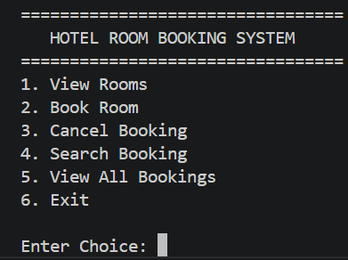
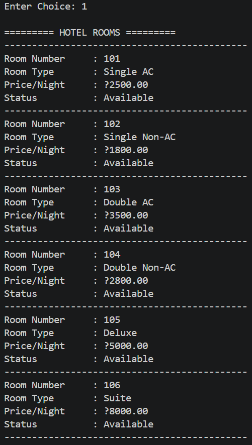
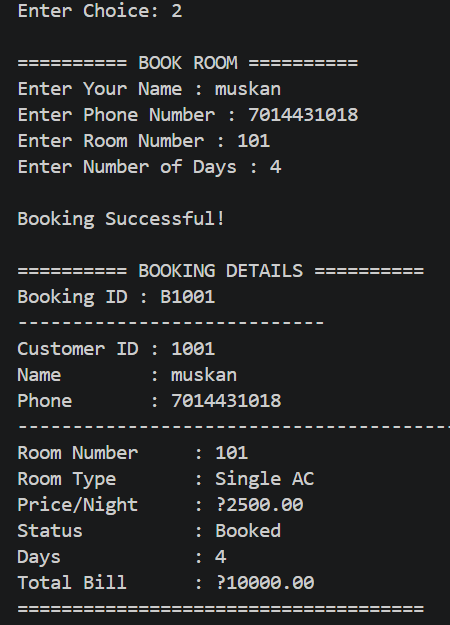
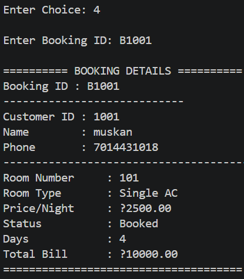
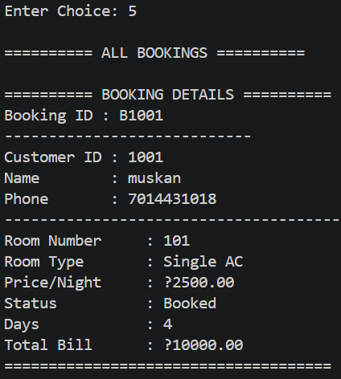
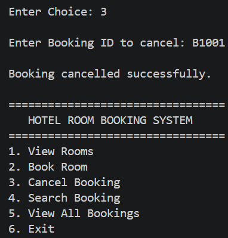
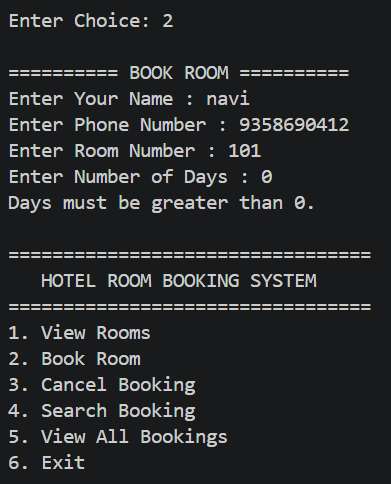

# 🏨 Hotel Room Booking Console Application

A Java-based **Hotel Room Booking Console Application** developed using **Object-Oriented Programming (OOP)** concepts. The application allows users to view rooms, book rooms, search bookings, cancel bookings, and store booking details using file handling.

---

## 🚀 Features

- 🛏️ View available hotel rooms
- ✅ Book a room
- 🔍 Search booking by Booking ID
- ❌ Cancel a booking
- 📋 View all bookings
- 💾 Save booking details to a text file
- ✔️ Input validation
- 🧱 Object-Oriented Design

---

## 🛠️ Technologies Used

- Java
- Object-Oriented Programming (OOP)
- Java Collections (ArrayList)
- File Handling
- Exception Handling
- Console-Based User Interface

---

## 📂 Project Structure

```text
HotelRoomBookingConsoleApp/
│
├── data/
│   └── bookings.txt
│
├── screenshots/
│   ├── main-menu.png
│   ├── view-rooms.png
│   ├── booking-success.png
│   ├── search-booking.png
│   ├── view-all-bookings.png
│   ├── cancel-booking.png
│   ├── validation.png
│   └── exit.png
│
├── src/
│   ├── app/
│   ├── model/
│   ├── service/
│   └── util/
│
├── README.md
├── LICENSE
└── .gitignore
```

---

# 📸 Project Screenshots

## 🏠 Main Menu



---

## 🛏️ View Rooms



---

## ✅ Booking Successful



---

## 🔍 Search Booking



---

## 📋 View All Bookings



---

## ❌ Cancel Booking



---

## ⚠️ Input Validation



---

## 🚪 Exit


---

## 🎯 Learning Outcomes

This project helped me understand:

- Object-Oriented Programming
- Class Design
- Encapsulation
- Constructors
- ArrayList
- File Handling
- Exception Handling
- Console Application Development
- Git & GitHub

---

## 🔮 Future Improvements

- Login Authentication
- Admin Dashboard
- Customer Management
- Database (MySQL)
- Java Swing GUI
- Online Payment Integration

---

## 👩‍💻 Author

**Muskan Bhadala**

B.Tech (Computer Science Engineering)

Java Developer | Learning DSA | Exploring Full Stack Development